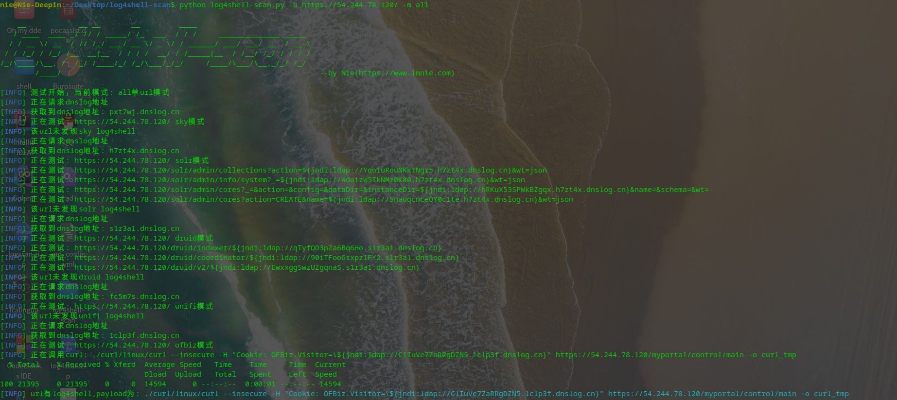
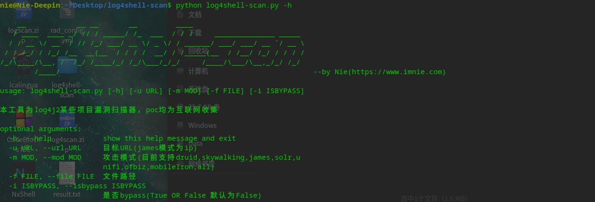

# log4shell-scan 一个公开poc打造的log4shell扫描器

## 说明

本扫描器集成了以下产品的log4shell漏洞:

- druid

- skywalking

- james

- solr

- unifi

- ofbiz

- mobileIron user portal

## 用法

```bash
  -h, --help            用法
  -u URL, --url URL     目标URL(james模式为ip)
  -m MOD, --mod MOD     攻击模式(目前支持druid,skywalking,james,solr,u
                        nifi,ofbiz,mobileIron,all)
  -f FILE, --file FILE  文件路径
  -i ISBYPASS, --isbypass ISBYPASS
                        是否bypass(True OR False 默认为False)
```

## 截图





#### 关于

本工具由Nie收集公开poc编写

Nie：https://www.imnie.com
